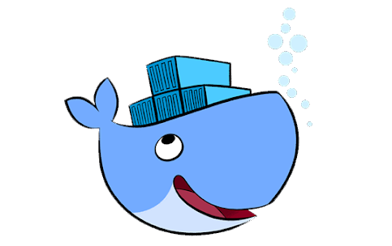

# [Meetup Docker & Companhia](https://docker-sorocaba.github.io/Meetup.Devops/)

[Link da página principal de divulgação do Meetup](https://docker-sorocaba.github.io/Meetup.Devops/)

Este é um grupo para os interessados ​​em Docker, Kubernetes, DevOps e novas tecnologias. Todos os níveis de competências são bem-vindos.

Eu comecei este grupo para conhecer outros entusiastas das novas tecnologias.  Ansioso para explorar e aprender novas ferramentas com todos.  O grupo está em fase de concebimento, aceito ajudas, apoios, speakers...  

**Venha me ajudar nessa jogada, Sorocaba precisa de eventos como esse!**

[Link da página do evento no Sympla](https://www.sympla.com.br/3-meetup-devops--cia-sorocaba__629638)

## Como posso colaborar ?

Existem três maneiras, entre tantas outras, de nos ajudar:

1. Participando e compartilhando em suas redes sociais o nosso evento
2. Compartilhando conhecimento na prática
3. Colaborando com o custo do Coffee-Break

### 1. Participando e compartilhando em suas redes sociais o nosso evento

O principal motivo de estarmos realizando esse evento é a deficiência de comunidades relacionadas ao assunto em nossa cidade. Sorocaba merece ter uma comunidade ativa que discuta as novas tecnologias.
Por isso, se você já conhece bem o assunto, venha compartilhar seu conhecimento. Caso seja novo no assunto , venha participar pois a ânsia de aprender de um aliada à vontade de ensinar do outro, fará de Sorocaba uma cidade com profissionais cada vez melhores.

### 2. Compartilhando conhecimento na prática

Se você  manja de Docker, K8S e Cultura Devops, você é muito bem-vindo à palestra, pois cremos que não só você, mas também todos sairemos ganhando.

Caso tenha interesse. O primeiro passo é submeter um novo projeto no nosso github, é bem simples:

- Abra uma nova **issues** no nosso repositório [docker-sorocaba/Meetup.Devops](https://docker-sorocaba.github.io/Meetup.Devops/)
- Adicione o Título da Palestra/Workshop
- Na descrição, adicione o assunto de sua palestra, etc..
- Adicione uma bio sobre você, e seu perfil do linkedin

### 3. Colaborando com o custo do Coffee-Break

Nossa ideia é sempre oferecer um coffee para todos os presentes como forma de interação e networking. Se quiser ajudar com o custo e/ou oferecer brindes da sua marca, mande um whats para **Marcos (15) 98808-2972**.

